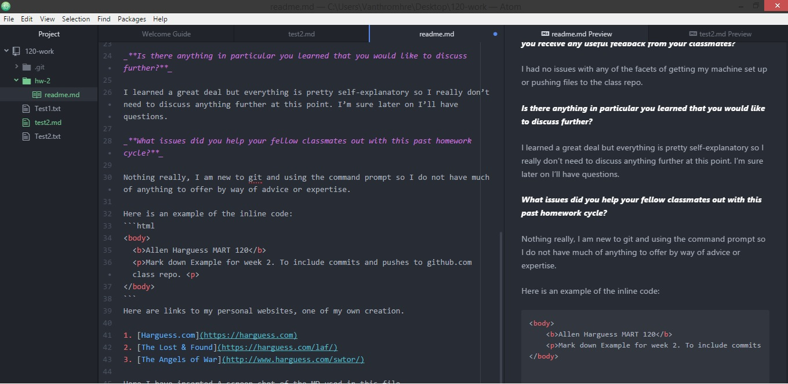

Allen Harguess 51

# Markdown and GitHub.com
##  My use of Markdown
##  

_**Summarize the work you did this homework cycle. Paying particular attention to the individual choices you made.**_

To sum it up, I installed the programs I needed to create, track, and push my homework file. Practiced using those programs. Then created the files needed to complete the week’s assignment and pushed them up to my class repo on github.com.

_**What steps did you take to complete the assignment?**_

- I installed the various Tools needed for development _Git, Atom, and Github Desktop_
- I created a file called **“Test1.txt”** with the command prompt.
- I completed two edits of **“Test1.txt”** and two commits.
- I Checks the status and differences using of the commits git.
- I did a third edit to **“Test1.txt”** and added a second file **“Test2.txt”**
- I completed a third commit of the changes.
- I pushed the repository up to my class repository on github.com.
- I copied the contents of a markdown file using it to create **“test2.md”**
- I created **“readme.md”** using md, following prompts given for the document.

_**Did you have any problems or issues? How did you solve these? Did you post about these to the class repo issue tracker? Did you receive any useful feedback from your classmates?**_

I had no issues with any of the facets of getting my machine set up or pushing files to the class repo.

_**Is there anything in particular you learned that you would like to discuss further?**_

I learned a great deal but everything is pretty self-explanatory so I really don’t need to discuss anything further at this point. I’m sure later on I’ll have questions.

_**What issues did you help your fellow classmates out with this past homework cycle?**_

Nothing really, I am new to git and using the command prompt so I do not have much of anything to offer by way of advice or expertise.

Here is an example of the inline code:
```html
<body>
	<b>Allen Harguess MART 120</b>
	<p>Mark down Example for week 2. To include commits and pushes to github.com class repo. <p>
</body>
```
Here are links to my personal websites, one of my own creation.

1. [Harguess.com](https://harguess.com)
2. [The Lost & Found](https://harguess.com/laf/)
3. [The Angels of War](http://www.harguess.com/swtor/)

Here I have inserted A screen shot of the MD used in this file.


